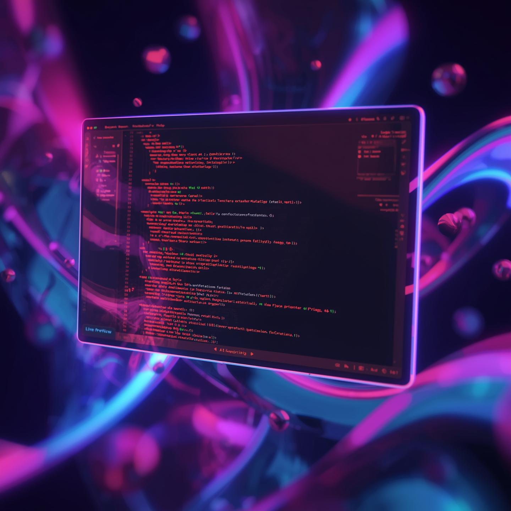

# 🚀 ReactRun AI - Visual React Component Builder With Ai Analysis Tool

<div align="center">
  
  
  
  
</div>

<div align="center">
  <h3>🎯 The Future of React Development is Here</h3>
  <p><strong>Build, Edit, and Analyze React Components Visually with AI-Powered Insights</strong></p>
  
  <a href="https://runreactai.vercel.app" target="_blank">
    
  </a>
  <a href="#getting-started">
    
  </a>
</div>

---

## 🌟 Why ReactRun AI?

**A modern React component development platform** that combines visual editing with AI-powered code analysis

### 💡 The Problem We Solve
- ❌ **Slow component development** - Hours spent on boilerplate code
- ❌ **Inconsistent code quality** - Manual reviews miss critical issues  
- ❌ **Poor developer experience** - Context switching between editor and browser
- ❌ **Limited AI integration** - Existing tools lack intelligent insights

### ✨ The ReactRun AI Solution
- ✅ **Visual Component Builder** - Drag, drop, and see changes instantly
- ✅ **AI-Powered Code Analysis** - Get intelligent suggestions in real-time
- ✅ **Live Preview** - See your components render as you build them
- ✅ **Zero Configuration** - Start building in under 30 seconds

---

## 🎬 See It In Action

<div align="center">
  <a href="https://runreactai.vercel.app" target="_blank">
    
  </a>
  <p><em>Click to experience the magic of visual React development</em></p>
</div>

---

## 🚀 Features That Set Us Apart

<table>
<tr>
<td width="50%">

### 🎨 **Visual Editor**
- **Real-time preview** of your components
- **Drag & drop** interface for rapid prototyping
- **Live code updates** as you design
- **Responsive design** testing built-in

</td>
<td width="50%">

### 🤖 **AI-Powered Analysis**
- **Intelligent code review** with GPT-4
- **Performance optimization** suggestions
- **Best practices** recommendations
- **Bug detection** and fixes

</td>
</tr>
<tr>
<td width="50%">

### ⚡ **Lightning Fast**
- **Sub-second** component compilation
- **Hot reload** for instant feedback
- **Optimized bundling** for production
- **Edge-deployed** for global speed

</td>
<td width="50%">

### 🛠️ **Developer Experience**
- **Zero configuration** setup
- **TypeScript** support out of the box
- **Modern React** patterns and hooks
- **Export ready** production code

</td>
</tr>
</table>

---

## 🔧 Technical Architecture

<div align="center">
  
  
  
  
</div>

### 🏗️ **Architecture Overview**
- **Frontend**: React 18+ with TypeScript, Vite for blazing fast builds
- **Backend**: Node.js/Express API server with OpenAI integration
- **AI Engine**: OpenRouter with multiple model support (GPT, Claude, etc.)
- **Styling**: Tailwind CSS with custom design system
- **State Management**: React hooks with local state optimization
- **Build System**: Vite with optimized chunking and tree-shaking

---

## 🏃‍♂️ Getting Started

### ⚡ Quick Start (< 2 minutes)

```bash
# Clone the repository
git clone https://github.com/Adi4512/runable-on-steroid.git

# Navigate to project
cd runable-on-steroid

# Install dependencies
npm install

# Start the development server
npm run dev

# Start the AI backend
cd backend && npm install && npm start
```

### 🔧 Configuration

Create your environment files:

**Frontend (.env)**
```env
VITE_BACKEND_URL=http://localhost:3000
```

**Backend (backend/.env)**
```env
OPENAI_API_KEY=your_openai_api_key_here
PORT=3000
```

### 🌐 Deploy to Production

```bash
# Deploy frontend to Vercel
vercel deploy

# Deploy backend to Render
# Push to GitHub and connect to Render
```

---

## 🛠️ Tech Stack

<div align="center">

| Frontend | Backend | AI/ML | Deployment |
|----------|---------|--------|------------|
|  |  |  |  |
|  |  |  |  |
|  |  |  |  |

</div>

---

## 📈 Roadmap & Vision

### 🎯 Current Version (v1.0)
- ✅ Visual component editor
- ✅ AI-powered code analysis
- ✅ Real-time preview
- ✅ Export functionality

### 🚀 Coming Soon (v2.0)
- 🔄 **Component Library** - Pre-built components marketplace
- 🔄 **Team Collaboration** - Real-time multiplayer editing
- 🔄 **Version Control** - Git integration and history
- 🔄 **Advanced AI** - Custom model training

### 🌟 Future Vision (v3.0+)
- 🔮 **Design to Code** - Convert Figma designs to React
- 🔮 **Performance Analytics** - Real-time performance insights
- 🔮 **Enterprise Features** - SSO, audit logs, compliance
- 🔮 **Mobile App** - Build components on the go

---

## 🤝 Contributing

We welcome contributions from developers worldwide! Here's how you can help:

### 🎯 Ways to Contribute
- 🐛 **Report bugs** - Help us improve the platform
- 💡 **Suggest features** - Shape the future of ReactRun AI
- 🔧 **Submit PRs** - Fix issues and add new features
- 📖 **Improve docs** - Help other developers get started

### 📋 Contribution Guidelines

```bash
# Fork the repository
# Create a feature branch
git checkout -b feature/amazing-feature

# Make your changes
# Commit with conventional commits
git commit -m "feat: add amazing feature"

# Push to your fork
git push origin feature/amazing-feature

# Open a Pull Request
```

---

## 🛡️ Code Quality & Performance

<div align="center">
  
  
  
</div>

### 📊 **Performance Metrics**
- **First Contentful Paint**: < 1.5s
- **Largest Contentful Paint**: < 2.5s  
- **Cumulative Layout Shift**: < 0.1
- **Time to Interactive**: < 3s
- **Bundle Size**: Optimized with code splitting

---

## 📞 Support & Community

<div align="center">

| Platform | Link | Description |
|----------|------|-------------|
| 🌐 **Website** | [runreactai.vercel.app](https://runreactai.vercel.app) | Try live |
| 🐦 **Twitter** | [@adisha_10](https://twitter.com/adisha_10) | Latest updates & tips |
| 📧 **Email** | adityasharma4510@gmail.com | Enterprise inquiries |

</div>

---

## 📄 License

This project is licensed under the MIT License - see the [LICENSE](LICENSE) file for details.

---

<div align="center">
  <h3>🌟 Star us on GitHub if you find ReactRun AI useful!</h3>
  <p>Made with ❤️ by <a href="https://github.com/Adi4512">Aditya</a></p>
  
  <a href="https://github.com/Adi4512/runable-on-steroid">
    
  </a>
  <a href="https://twitter.com/adisha_10">
    
  </a>
</div>

---

<div align="center">
  <sub>Built with 🚀 by developers, for developers. Join the future of React development.</sub>
</div>
